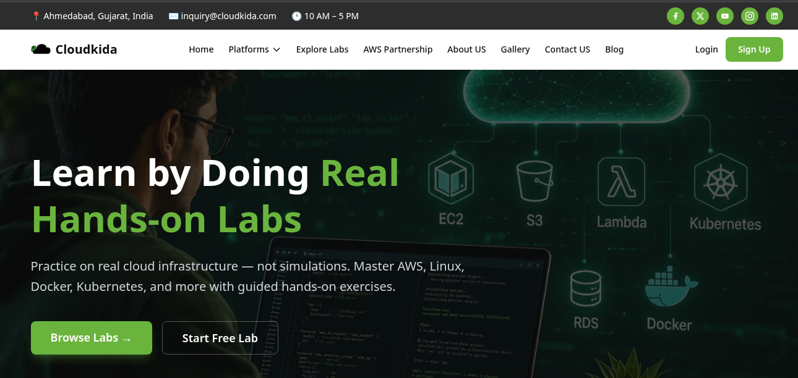
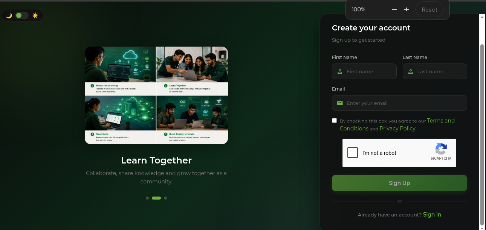

# Amazon S3 Hands-On Lab — CloudKida Booth Edition

Host a real website on AWS in two stages. No credit card, no local setup, AWS Console only.

| | |
|---|---|
| **Time** | ~15 minutes |
| **Level** | Beginner, no AWS experience needed |
| **You need** | A laptop, a browser, and an email address |
| **You get** | A live website URL you can share |

1. **Stage 1** — upload a file to S3.
2. **Stage 2** — turn that bucket into a live static website.

---

## Step 0 — Get your free AWS lab account

You don't need your own AWS account. CloudKida gives you a real one for the lab.

### a. Sign up at [cloudkida.com](https://cloudkida.com)

Click **Sign Up** in the top-right corner.



Fill in **First Name**, **Last Name**, and **Email**. Tick the Terms checkbox, clear the
reCAPTCHA, then click **Sign Up**.



### b. Check your email for the temporary password

There's no password field on the sign-up form. CloudKida emails you a **temporary
password** instead. Check your inbox, and your spam folder if it's not there within a
minute.

### c. Sign in with the temporary password

Go to **Login**, enter your email and the temporary password from the email. Set a
password of your own when prompted.

### d. Open the lab

Navigate to **Dashboard → AWS → View lab**, then launch it. The lab hands you a
sign-in link and credentials for the AWS Console.

> Keep the lab tab open. The environment has a time limit, and everything you create
> inside it is cleaned up automatically when it expires.

---

## Stage 1 — Upload a file to S3

### Step 1. Create a bucket

In the AWS Console, search for **S3** and open it. Click **Create bucket**.

- **Bucket name**: `cloudkida-<your-name>` — bucket names are globally unique, so add
  numbers if the name is taken
- **Region**: `US East (N. Virginia) us-east-1`

Leave everything else as-is and click **Create bucket**.

### Step 2. Upload the site files

Get the files onto your laptop — clone the repo:

```bash
git clone https://github.com/pushkar-khatavkar/S3.git
cd S3
```

No git? Open [the repo](https://github.com/pushkar-khatavkar/S3) and use
**Code → Download ZIP**, then unzip it.

Now open your bucket in the console and click **Upload → Add files**. Select these files:

```
index.html   about.html   login.html   error.html
style.css    favicon.svg  s3-static-website.svg
```

Click **Upload**, then **Close**. Your files are now in S3.

### Step 3. Try to open index.html

Click `index.html`, then click its **Object URL**.

You'll get an **Access Denied** error. That's correct — S3 buckets are private by
default. Stage 2 fixes that.

---

## Stage 2 — Turn the bucket into a website

### Step 4. Enable static website hosting

In your bucket, go to the **Properties** tab. Scroll to the bottom, find
**Static website hosting**, and click **Edit**.

- **Static website hosting**: Enable
- **Hosting type**: Host a static website
- **Index document**: `index.html`
- **Error document**: `error.html`

Click **Save changes**, then copy the **Bucket website endpoint** that appears.

### Step 5. Allow public reads

Two things have to happen: unblock public access, then grant read permission.

**5a.** Go to the **Permissions** tab → **Block public access (bucket settings)** →
**Edit**. Uncheck **Block all public access**, click **Save changes**, and type `confirm`.

**5b.** Still in **Permissions**, scroll to **Bucket policy** → **Edit**. Paste this,
replacing `YOUR-BUCKET-NAME` with your actual bucket name:

```json
{
  "Version": "2012-10-17",
  "Statement": [
    {
      "Sid": "PublicReadGetObject",
      "Effect": "Allow",
      "Principal": "*",
      "Action": "s3:GetObject",
      "Resource": "arn:aws:s3:::YOUR-BUCKET-NAME/*"
    }
  ]
}
```

Click **Save changes**. The bucket now shows a **Publicly accessible** badge.

> This policy makes every object in the bucket readable by anyone on the internet. That's
> what we want for a public website — never do it for a bucket holding private data.

### Step 6. Open your website

Paste the **Bucket website endpoint** from Step 4 into your browser:

```
http://cloudkida-<your-name>.s3-website-us-east-1.amazonaws.com
```

The CloudKida site loads, styled and clickable. Try a URL that doesn't exist to see
`error.html` do its job.

**That's a website on AWS with zero servers.** Show it to us at the booth 👋

---

## What you just built

```text
Browser ──► S3 Website Endpoint ──► your bucket
                                      ├─ static website hosting (index + error docs)
                                      └─ bucket policy (public s3:GetObject)
```

No EC2 instance, no web server to patch, no scaling to configure. S3 serves the files
and you pay only for storage and requests.

---

## Clean up (optional)

The lab environment tears itself down, but if you want to do it by hand:
open the bucket → **Empty** → type `permanently delete` → then **Delete** the bucket.

---

## Keep going

| Next | Where |
|---|---|
| The full 2-hour S3 deep dive: versioning, CORS, access points, multipart upload, Transfer Acceleration, Python SDK | [`docs/s3-masterclass.md`](docs/s3-masterclass.md) |
| What's in this repo, CLI deploy, custom domain + HTTPS | [`docs/site-reference.md`](docs/site-reference.md) |
| 217+ more hands-on labs across AWS, Linux, and Windows | [cloudkida.com](https://cloudkida.com) |

---

Questions at the booth? Grab any of us, or email
[inquiry@cloudkida.com](mailto:inquiry@cloudkida.com).

© CloudKida — [cloudkida.com](https://cloudkida.com)
